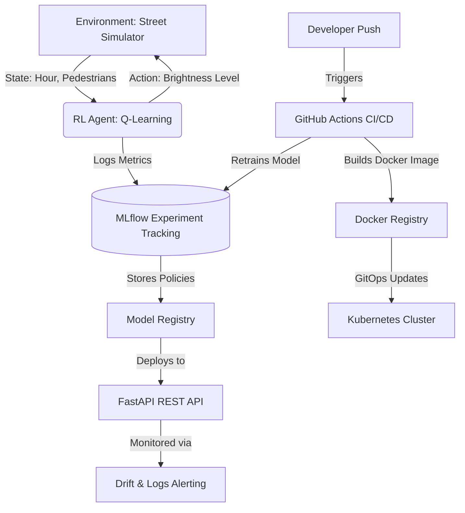

# 🌆 Smart Adaptive Street Lighting using Reinforcement Learning

> **SDG 7** — Affordable and Clean Energy &nbsp;|&nbsp; **SDG 11** — Sustainable Cities and Communities

A complete tabular **Q-Learning** project that teaches a city's street lights to adapt brightness
based on pedestrian presence and time of day — drastically cutting energy waste without compromising public safety.

---

## 🌍 Problem Statement
Current street lighting systems typically use a fixed-timer approach (100% brightness from dusk till dawn). This leads to massive energy waste during late-night hours when there are no pedestrians or traffic, while completely turning off lights could compromise public safety. The goal is to build an intelligent, adaptive street lighting system using Reinforcement Learning that minimizes energy consumption while maximizing pedestrian safety.

## 🏗️ Architecture Diagram



## 🗂️ Project Structure

```
streetlight-rl/
├── sim/
│   ├── __init__.py
│   └── environment.py      # RL environment (state, action, reward)
├── configs/
│   └── qlearning_v1.yaml   # All hyperparameters & run config
├── experiments/
│   ├── results_run1.csv    # Experiment log (auto-appended per run)
│   └── plots/              # Generated charts
│       ├── reward_curve.png
│       ├── energy_comparison.png
│       ├── action_distribution.png
│       ├── hourly_heatmap.png
│       └── reward_energy_box.png
├── policies/
│   ├── policy_v1.pkl       # Checkpoint at episode 1 000
│   └── policy_v2.pkl       # Final trained policy
├── train.py                # Training entry-point
├── evaluate.py             # Evaluation & comparison
├── requirements.txt
└── README.md
```

---

## ⚙️ RL Design

| Component | Details |
|-----------|---------|
| **Algorithm** | Tabular Q-Learning |
| **State** | `(hour [0-23], pedestrian_bin [0-4], current_brightness [0-3])` |
| **Actions** | `0=Off` / `1=Dim` / `2=Medium` / `3=Full` |
| **Reward** | +10 pedestrian+bright · -10 no pedestrian+Full · -5 energy waste |
| **Exploration** | ε-greedy (ε = 0.1, decays to 0.01) |
| **State space** | 24 × 5 × 4 = **480 states** |

### Reward Function

```
pedestrians > 0:
    action ∈ {Medium, Full}  →  +10   (safe, well-lit)
    action == Dim            →   -2   (marginal safety)
    action == Off            →  -15   (dangerous!)

pedestrians == 0:
    action == Full           →  -10   (unnecessary waste)
    any action               →  -(watts/100) × 5   (energy penalty)
```

---

## 🚀 Quick Start

### 1. Install dependencies

```bash
pip install -r requirements.txt
```

### 2. Setup Data Versioning (DVC)

```bash
dvc init
dvc add data/  # Assuming raw data exists
git add data.dvc .dvc/config
```

### 3. Train the agent (with MLFlow tracking)

```bash
mlflow server --host 127.0.0.1 --port 5000 &
python train.py --config configs/qlearning_v1.yaml
```

Override episodes without editing the YAML:

```bash
python train.py --config configs/qlearning_v1.yaml --episodes 2000
```

### 3. Evaluate saved policies

```bash
# Evaluate final policy vs baseline
python evaluate.py --policy policies/policy_v2.pkl --config configs/qlearning_v1.yaml

# Compare v1 vs v2 vs baseline
python evaluate.py --policy policies/policy_v2.pkl \
                   --compare policies/policy_v1.pkl \
                   --config configs/qlearning_v1.yaml
```

---

## 📊 Output Artefacts

| File | Description |
|------|-------------|
| `experiments/results_run1.csv` | Per-run metrics: reward, energy, cost saved |
| `experiments/plots/reward_curve.png` | Smoothed training reward over episodes |
| `experiments/plots/energy_comparison.png` | RL vs Baseline energy & cost bar charts |
| `experiments/plots/action_distribution.png` | % of Off/Dim/Medium/Full chosen per policy |
| `experiments/plots/hourly_heatmap.png` | Preferred action per hour of day |
| `experiments/plots/reward_energy_box.png` | Reward & energy distribution box plots |
| `policies/policy_v1.pkl` | Q-table at episode 1 000 |
| `policies/policy_v2.pkl` | Q-table at episode 5 000 (final) |

---

## 🔁 Reproducing Runs

All parameters live in `configs/qlearning_v1.yaml`. The key knobs are:

```yaml
run:
  id: "run_001"
  seed: 42                   # change for independent replications

agent:
  learning_rate: 0.1
  discount_factor: 0.95
  epsilon: 0.1
  epsilon_decay: 0.995

training:
  episodes: 5000
```

Each call to `python train.py` appends one row to `experiments/results_run1.csv`, so you
can run experiments with different configs and compare them later.

---

## 📈 Baseline Comparison

The **Fixed-Timer** baseline always sets brightness to `Full` between 18:00–06:00 and `Off`
otherwise — a common dumb policy used in many cities today.

| Metric | RL Policy | Fixed Timer |
|--------|-----------|-------------|
| Avg Episode Reward | **higher** | lower |
| Energy per day (Wh) | **lower** | higher |
| Unnecessary Lighting | **≪** | high |
| Cost Saved | ✅ positive | baseline |

---

## 🔍 Monitoring Plan (Real-world Deployment)
If this smart street lighting model were deployed in a real-world city intersection, we would monitor:
- **Data Drift:** Unexpected shifts in pedestrian traffic patterns (e.g., a new nightclub opens nearby, skewing late-night counts).
- **Concept Drift:** Changes in safety requirements or electricity pricing that alter the reward function dynamics.
- **System Metrics:** Average wait-time/delay for API requests to ensure real-time action taking (<10ms).
- **Safety KPIs:** Tracking occurrences of "red-light running" equivalent or complaints of insufficient lighting.
We log every API prediction to analyze prediction distribution over time and alert on anomalies.

---

## 🎥 5-Minute Video Demo Outline
**Slide 1: Problem & SDG Impact**
- Explain energy waste of fixed-timers. Mention SDG 7 & SDG 11.
**Slide 2: Design Choices (RL vs Heuristics)**
- Why Q-Learning? Discrete, small state space makes tabular Q-Learning highly sample-efficient and interpretable compared to Deep RL.
**Slide 3: MLOps Architecture**
- Explain MLflow for tracking, FastAPI + Docker for serving, and GitHub Actions for CI/CD.
**Slide 4: Challenges & Lessons Learned**
- *Challenge:* Balancing the reward function. Initial models turned off lights too often to save energy. 
- *Lesson:* Adding a huge negative penalty (-15) for off-lights during pedestrian presence fixed it.
**Slide 5: References to New Tools**
- Highlighting how integrating MLflow made comparing hyperparameters (epsilon decay) much easier. Fast-tracking deployment via Docker & Kubernetes.

---

## 🌍 SDG Impact

| Goal | How This Project Contributes |
|------|------------------------------|
| **SDG 7** – Clean Energy | Reduces street-light energy consumption by adapting to actual pedestrian traffic |
| **SDG 11** – Sustainable Cities | Improves public safety by ensuring adequate lighting only when people are present |

---

## 🛠️ Configuration Reference (`qlearning_v1.yaml`)

```yaml
run.id            # Unique identifier for the experiment run
run.seed          # Random seed for full reproducibility

environment.episode_length   # Steps per episode (24 = full day)
environment.max_pedestrians  # Upper bound for pedestrian count simulation

agent.learning_rate          # α – Q-table update step size
agent.discount_factor        # γ – weight for future rewards
agent.epsilon                # Initial exploration probability
agent.epsilon_min            # Minimum epsilon after decay
agent.epsilon_decay          # Multiplicative decay per episode

training.episodes            # Total training episodes
policy.v1_checkpoint         # Episode at which policy_v1.pkl is saved
policy.v2_checkpoint         # Episode at which policy_v2.pkl is saved (end)

logging.results_file         # CSV path for run logs
logging.plot_dir             # Directory for generated plots

energy.cost_per_kwh          # Electricity price for cost calculation (USD)
```

---

## 📦 Dependencies

numpy>=1.24.0
matplotlib>=3.7.0
PyYAML>=6.0
mlflow>=2.0.0
fastapi>=0.100.0
uvicorn>=0.20.0
dvc>=3.0.0
```

No deep-learning frameworks required — pure Python tabular Q-Learning integrated with modern MLOps tools!

---

*Built with ❤️ for sustainable urban infrastructure.*
